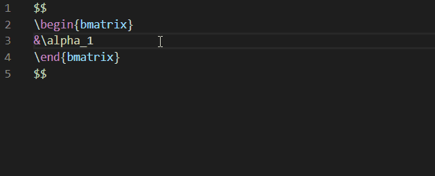
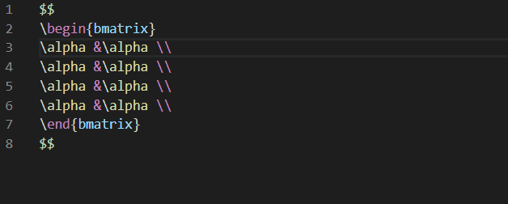
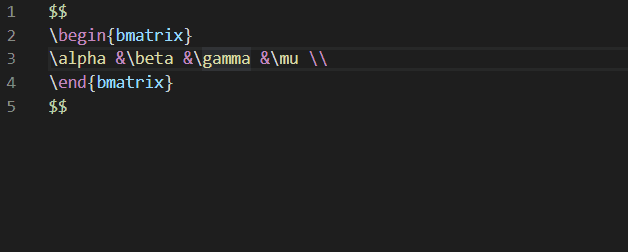
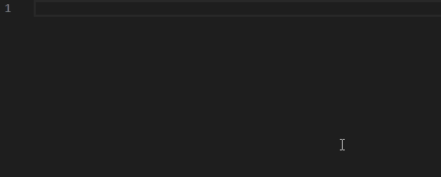
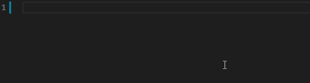
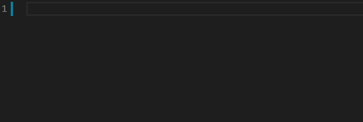

# 剪贴板图片自动上传图床

使用快捷键 "Shift + Ctrl + Alt + V" 可以将剪贴板内的图片自动上传到头条图床, 并以 Markdown 形式粘贴在当前位置.

代码参考 [vscode-paste-image](https://github.com/mushanshitiancai/vscode-paste-image) 和 [upimg](https://www.npmjs.com/package/upimg).

# 行内复制与移动

## 复制

使用快捷键 "Shift + Alt + ←" 将选中内容在行内向左复制。

使用快捷键 "Shift + Alt + →" 将选中内容在行内向右复制。

## 多行复制

## 移动

使用快捷键 "Alt + ←" 将选中内容在行内向左移动。

使用快捷键 "Alt + →" 将选中内容在行内向右移动。

## 单选

使用快捷键 "Ctrl + Alt + U" 将光标变为一个。

# 计算器功能

计算器功能一共有三个快捷键，分别是：

1. 定义（Define）："Shift + Ctrl + Alt + D"
2. 等于（Equal）："Shift + Ctrl + Alt + E"
3. 替换（Replace）："Shift + Ctrl + Alt + R"

这三个命令实际上效果相同，唯一区别是输出的内容。

“定义”什么都不会输出，通常用来定义变量，如 “x=3”。

“等于”会将计算结果加上等于号并接在当前选中区域之后，如 “1+2” 会变成 “1+2=3”。

“等于”会用计算结果替换选中区域，如 “1+2” 会变成 “3”。

目前计算器支持数值运算，函数运算，多项式运算，矩阵运算等诸多运算，并且是用 Latex 表达式直接计算，输出结果也会自动转换为 Latex 形式。

PS：运算相关支持使用的是 “Mathjs” 库，一切 Mathjs 表达式均可以正常使用。

# Snippets

|Snippet|Name|Code|
|---|---|---|
|\\\\|\\\\|\\\\|
|\\\\\$|single line|\$\\displaystyle \$|
|\\\\\$|multiline|\$\$ ... \$\$|
|\\\\-|subscript|_{ }|
|\\\\6|superscript|^{ }|
|\\\\...|prefix|\\cdots|
|\\\\.|cdot|\\cdot|
|\\\\d|partial sign 'd'|{\\rm d}|
|\\\\dx|partial sign 'dx'|{\\rm d}x|
|\\\\dy|partial sign 'dy'|{\\rm d}y|
|\\\\set|set bracket|\\{ \\}|
|\\\\angle|angle bracket|\\langle \\rangle|
|\\\\comma|alpha with comma|\\alpha_1,\\alpha_2,\\cdots,\\alpha_n|
|\\\\plus|alpha with plus|\\alpha_1+\\alpha_2+\\cdots+\\alpha_n|
|\\\\multiply|alpha with multiply|\\alpha_1\\times \\alpha_2\\times \\cdots\\times \\alpha_n|
|\\\\dotmultiply|alpha with dot multiply|\\alpha_1\\cdot \\alpha_2\\cdots \\alpha_n|
|\\\\mline|A line of matrix|\\alpha &\\beta &\\cdots &\\lambda \\\\|
|\\\\smline|A line of matrix with subscript|\\alpha_1 &\\alpha_2 &\\cdots &\\alpha_n \\\\|
|\\\\vdots|A line of vdots|\\vdots &\\vdots & &\\vdots \\\\|
|\\\\aligned|A scope of aligned|\$\$ \\begin{aligned}  ... \\end{aligned} \$\$|
|\\\\matrix|A scope of matrix|\$\$ \\begin{matrix}  ... \\end{matrix} \$\$|
|\\\\bmatrix|A scope of bmatrix|\\begin{bmatrix}  ... \\end{bmatrix}|
|\\\\vmatrix|A scope of vmatrix|\\begin{vmatrix}  ... \\end{vmatrix}|
|\\\\pmatrix|A scope of pmatrix|\\begin{pmatrix}  ... \\end{pmatrix}|
|\\\\equations|Equations|...|
|\\\\zeroequations|Zero equations|...|

# How to use it

Similarly to `Shift + Alt + ↑↓`, you can press `Shift + Alt + ← →` to copy what you select to left or right.

Similarly to `Alt + ↑↓`, you can press `Alt + ← →` to move what you select to left or right.

You can also press `Ctrl + Alt + U` to single the selections.

There are many snippets in the extension and you can input `\\` and get the auto-complete function.

**You can press `Shift + Ctrl + Alt + D` to define the selection.**

**You can press `Shift + Ctrl + Alt + E` to calculate the selection.**

**You can press `Shift + Ctrl + Alt + R` to replace the selection.**

# Install

Search `Orangex4` in vscode extensions market and install the one called "Better Markdown&Latex Shortcuts".

# Display

## Calculator

## Copy

## Multicopy

## Move

## Single Selections

# Snippets

|Snippet|Name|Code|
|---|---|---|
|\\\\|\\\\|\\\\|
|\\\\\$|single line|\$\\displaystyle \$|
|\\\\\$|multiline|\$\$ ... \$\$|
|\\\\-|subscript|_{ }|
|\\\\6|superscript|^{ }|
|\\\\...|prefix|\\cdots|
|\\\\.|cdot|\\cdot|
|\\\\d|partial sign 'd'|{\\rm d}|
|\\\\dx|partial sign 'dx'|{\\rm d}x|
|\\\\dy|partial sign 'dy'|{\\rm d}y|
|\\\\set|set bracket|\\{ \\}|
|\\\\angle|angle bracket|\\langle \\rangle|
|\\\\comma|alpha with comma|\\alpha_1,\\alpha_2,\\cdots,\\alpha_n|
|\\\\plus|alpha with plus|\\alpha_1+\\alpha_2+\\cdots+\\alpha_n|
|\\\\multiply|alpha with multiply|\\alpha_1\\times \\alpha_2\\times \\cdots\\times \\alpha_n|
|\\\\dotmultiply|alpha with dot multiply|\\alpha_1\\cdot \\alpha_2\\cdots \\alpha_n|
|\\\\mline|A line of matrix|\\alpha &\\beta &\\cdots &\\lambda \\\\|
|\\\\smline|A line of matrix with subscript|\\alpha_1 &\\alpha_2 &\\cdots &\\alpha_n \\\\|
|\\\\vdots|A line of vdots|\\vdots &\\vdots & &\\vdots \\\\|
|\\\\aligned|A scope of aligned|\$\$ \\begin{aligned}  ... \\end{aligned} \$\$|
|\\\\matrix|A scope of matrix|\$\$ \\begin{matrix}  ... \\end{matrix} \$\$|
|\\\\bmatrix|A scope of bmatrix|\\begin{bmatrix}  ... \\end{bmatrix}|
|\\\\vmatrix|A scope of vmatrix|\\begin{vmatrix}  ... \\end{vmatrix}|
|\\\\pmatrix|A scope of pmatrix|\\begin{pmatrix}  ... \\end{pmatrix}|
|\\\\equations|Equations|...|
|\\\\zeroequations|Zero equations|...|

# Display

# Display (Source)

## Calculator

## Copy

## Multicopy

## Move

## Single Selections

## Snippets

